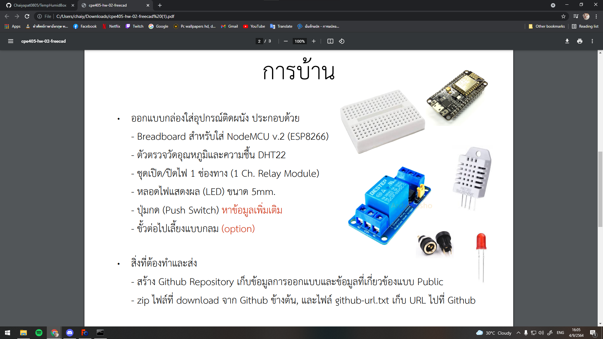

<h1>TempHumidBox</h1>

ตัวอย่างการสร้างกล่องใส่อุปกรณ์

โจทย์การทำงาน

  

  
<h2>อุปกรณ์ที่ใช้</h2>

 Breadboard สำหรับใส่ NodeMCU v.2 (ESP8266) 

ขนาด 46 mm x 35 mm

<a href="https://www.arduino4.com/product/183/mini-breadboard-%E0%B8%9A%E0%B8%AD%E0%B8%A3%E0%B9%8C%E0%B8%94%E0%B8%97%E0%B8%94%E0%B8%A5%E0%B8%AD%E0%B8%87%E0%B8%82%E0%B8%99%E0%B8%B2%E0%B8%94%E0%B9%80%E0%B8%A5%E0%B9%87%E0%B8%81-170-holes">Cilck go to link ref </a>

 ตัวตรวจวัดอุณหภูมิและความชื้น DHT22 

 ขนาด 28.2 mm x 13.1 mm x 10 mm 

<a href="https://www.robotsiam.com/product/151/dht22-temperature-and-humidity-sensor-pcb"> Cilck go to link ref </a>

 ชุดเปิด/ปิดไฟ 1 ช่องทาง (1 Ch. Relay Module) 

 ขนาด 28.2 mm x 13.1 mm x 10 mm 

<a href="https://shopee.co.th/3Vdc-Relay-Module--1-Channel--i.132454846.6317288773?gclid=Cj0KCQjwssyJBhDXARIsAK98ITSTbTrqiySkUXGqc3FEbjNzdiusM0mOwrT57KOdIOGrkTqwpDc0JGAaAhsrEALw_wcB"> Cilck go to link ref </a>

 หลอดไฟแสดงผล (LED) ขนาด 5mm 

 ขนาด 28.2 mm x 13.1 mm x 10 mm 

<a href="https://www.lazada.co.th/products/makeeasy-led-5mm-5-led-led-i2157454579-s7186560944.html?spm=a2o4m.searchlist.list.72.49e55d7bAi9KcA&search=1"> Cilck go to link ref </a>

