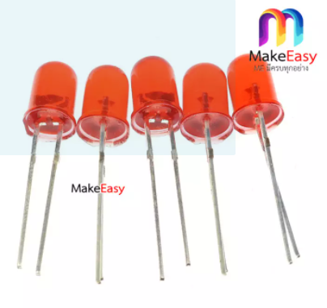

<h1>TempHumidBox</h1>

โจทย์การทำงาน

  

  
<h2>อุปกรณ์ที่ใช้</h2>

 Breadboard สำหรับใส่ NodeMCU v.2 (ESP8266) 

ขนาด : 46 mm x 35 mm

<a href="https://www.arduino4.com/product/183/mini-breadboard-%E0%B8%9A%E0%B8%AD%E0%B8%A3%E0%B9%8C%E0%B8%94%E0%B8%97%E0%B8%94%E0%B8%A5%E0%B8%AD%E0%B8%87%E0%B8%82%E0%B8%99%E0%B8%B2%E0%B8%94%E0%B9%80%E0%B8%A5%E0%B9%87%E0%B8%81-170-holes">Cilck go to link ref </a>

 ตัวตรวจวัดอุณหภูมิและความชื้น DHT22 

 ขนาด : 28.2 mm x 13.1 mm x 10 mm 

<a href="https://www.robotsiam.com/product/151/dht22-temperature-and-humidity-sensor-pcb"> Cilck go to link ref </a>

 ชุดเปิด/ปิดไฟ 1 ช่องทาง (1 Ch. Relay Module) 

 ขนาด : 4.2 x 2.6 x 1.8 cm 

<a href="https://shopee.co.th/3Vdc-Relay-Module--1-Channel--i.132454846.6317288773?gclid=Cj0KCQjwssyJBhDXARIsAK98ITSTbTrqiySkUXGqc3FEbjNzdiusM0mOwrT57KOdIOGrkTqwpDc0JGAaAhsrEALw_wcB"> Cilck go to link ref </a>

 หลอดไฟแสดงผล (LED) ขนาด 5mm 

 ขนาด : 5mm 

<a href="https://www.lazada.co.th/products/makeeasy-led-5mm-5-led-led-i2157454579-s7186560944.html?spm=a2o4m.searchlist.list.72.49e55d7bAi9KcA&search=1"> Cilck go to link ref </a>

 ปุ่มกด (Push Switch) 

 ขนาด : 12 mm x 12 mm 

<a href="https://shopee.co.th/Queen-2pcs-Big-Button-Button-Module-Big-Key-Button-Light-Touch-Switch-12mmx12mm-Hat-Output-Module-For-Arduino-i.22190646.6093923062?gclid=Cj0KCQjwssyJBhDXARIsAK98ITTCR3zka0bBjTx35GNgxiNoT6Vb1rHQqrx8VbwHBM8i88X5cqBluf8aAmCmEALw_wcB"> Cilck go to link ref </a>

 ชุดเปิด/ปิดไฟ 1 ช่องทาง (1 Ch. Relay Module) 

 ขนาด : 4.2 x 2.6 x 1.8 cm 

<a href="https://shopee.co.th/3Vdc-Relay-Module--1-Channel--i.132454846.6317288773?gclid=Cj0KCQjwssyJBhDXARIsAK98ITSTbTrqiySkUXGqc3FEbjNzdiusM0mOwrT57KOdIOGrkTqwpDc0JGAaAhsrEALw_wcB"> Cilck go to link ref </a>
 

 ขั้วต่อไปเลี้ยงแบบกลม 

 ขนาด : 3.7 mm 

<a href="https://www.lazada.co.th/products/js-910b-37-1-i899960679-s1817174327.html?exlaz=d_1:mm_150050845_51350205_2010350205::12:12654756915!117524295342!!!pla-294682000766!c!294682000766!1817174327!135253431&gclid=Cj0KCQjwssyJBhDXARIsAK98ITR1MCnF94tveQ1Qvz00456ZXcG89rLSUP0R-mrSYsodgyDPuh--RJ4aAidCEALw_wcB"> Cilck go to link ref </a>

 น็อต M2 - M3 

 ขนาด : M2 1.5 mm - M3 2.5 mm 

<a href="http://www.dojogarden.com/index.php?id_product=84&controller=product"> Cilck go to link ref </a>

<h2> โมเดลชิ้นงาน </h2>

 ตัวอย่างการสร้างกล่องใส่อุปกรณ์ 

 โดยจะแบ่งเป็นสองส่วนคือ ส่วน BodyAll1 คือส่วนฐานข้างล่าง และ BodyAll2 คือส่วนฝาปิดด้านบน 

 ขนาดของแผ่นฐาน และ ฝา : 90 mm x 60 mm 

 ขนาดของแผ่นฝา : 90 mm x 60 mm 

 ขนาดของขอบฐาน : 90 mm x 20 mm และ 60 mm x 20 mm 

 ขนาดของขอบฝา : 90 mm x 15 mm และ 60 mm x 15 mm 

 ขนาดของรูที่ต่อสายไฟ Relay : 20 mm x 6 mm 

 ขนาดของรูขั้วต่อไปเลี้ยงแบบกลม : 4.5 mm 

 ขนาดของรู LED : 5 mm 

 ขนาดของรู Button : 12 mm 

 ขนาดของรู DHT : 25 mm x 13.5 mm 

 ขนาดของรูน็อตเชื่อมRelay : 1.5 mm 

 ขนาดของรูน็อตเชื่อมกล่อง : 1.5 mm 

 ขนาดของรูน็อตเชื่อมผนัง : 2.5 mm 

<h2> ตัวอย่างโมเดลชิ้นงาน </h2>

 ภาพรวมชิ้นงาน 

 ภาพรวมชิ้นงานขวา 

 ภาพรวมชิ้นงานด้านบน 

